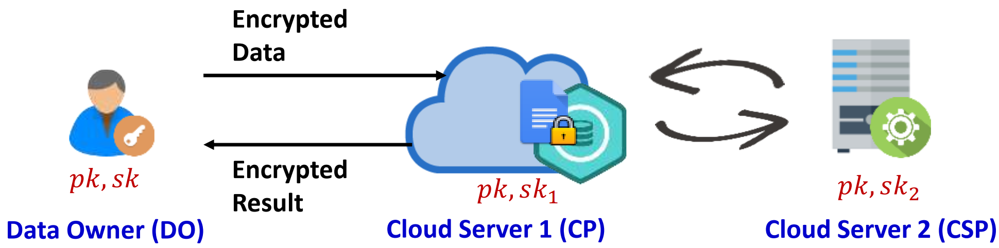

# <center>Secure Computation on Integers —— Python Project

# SOCI
.
SOCI (secure outsourced computation on integers scheme) provides a twin-server architecture for secure outsourced computation based on Paillier cryptosystem, which supports computations on encrypted integers rather than just natural numbers [1]. It significently improves the computation efficiency compared with fully homomorphic encryption mechanism. SOCI includes a suite of efficient secure computation protocols, including secure multiplication ($\textsf{SMUL}$), secure comparison ($\textsf{SCMP}$) and secure dot production ($\textsf{SDOT}$). The protocols realize secure computations on both non-negative integers and negative integers. 


# Preliminary

The protocols in SOCI are built based on Pailliar cryptosystem with threshold decryption (PaillierTD), which is a variant of the conventional Paillier cryptosystem. PaillierTD splits the private key of the Paillier cryptosystem into two partially private keys. Any partially private key cannot effectively decrypt a given ciphertext encrypted by the Paillier cryptosystem. PaillierTD consists of the following algorithms.

$\textbf{Key Generation} (\textsf{KeyGen})$: Let $p,q$ be two strong prime numbers (i.e., $p=2p'+1$ and $q=2q'+1$, where $p'$ and $q'$ are prime numbers) with $\kappa$ bits (e.g., $\kappa=512$). Compute $N=p\cdot q$, $\lambda=lcm(p-1,q-1)$ and $\mu=\lambda^{-1}\mod N$. Let the generator $g=N+1$, the public key $pk=(g,n)$ and the private key $sk=\lambda$.

The private key $\lambda$ is split into two parts denoted by $sk_1=\lambda_1$ and $sk_2=\lambda_2$, s.t., $\lambda_1+\lambda_2=0\mod\lambda$ and $\lambda_1+\lambda_2=1\mod N$. According to the Chinese remainder theorem, we can calculate $\sigma=\lambda_1+\lambda_2=\lambda\cdot\mu\mod(\lambda\cdot\mu)$ to make $\delta=0\mod\lambda$ and $\delta=1\mod N$ hold at the same time, where $\lambda_1$ can be a $\sigma$-bit random number and $\lambda_2=\lambda\cdot\mu+\eta\cdot\lambda N-\lambda_1$ ($\eta$ is a non-negative integer).

$\textbf{Encryption} (\textsf{Enc})$: Taken as input a message $m\in\mathbb{Z}_N$, this algorithm outputs $[\![m]\!]\leftarrow\textsf{Enc}(pk,m)=g^m\cdot r^N\mod N^2$, where $r$ is a random number in $\mathbb{Z}^*_N$ and $[\![m]\!]=[\![m\mod N]\!]$. 

$\textbf{Decryption} (\textsf{Dec})$: Taken as input a ciphertext $[\![m]\!]$ and $sk$, this algorithm outputs $m\leftarrow\textsf{Dec}(sk,[\![m]\!])=L([\![m]\!]^{\lambda}\mod N^2)\cdot\mu\mod N$, where $L(x)=\frac{x-1}{N}$.

$\textbf{Partial Decryption} (\textsf{PDec})$: Take as input a ciphertext $[\![m]\!]$ and a partially private key $sk_i$ ($i\in\{1,2\}$), and outputs $M_i\leftarrow\textsf{PDec}(sk_i,[\![m]\!])=[\![m]\!]^{\lambda_i}\mod N^2$.

For brevity, we will omot $\mod N^2$ for $\textsf{Enc}$ algorithm in the rest of the document.

PaillierTD has the additive homomorphism and scalar-multipilication homomorphism as follows.

- Additive homomorphism: $\textsf{Dec}(sk,[\![m_1+m_2\mod N]\!])=\textsf{Dec}(sk,[\![m_1]\!]\cdot[\![m_2]\!])$;

- Scalar-multiplication homomorphism: $\textsf{Dec}(sk,[\![c\cdot m\mod N]\!])=\textsf{Dec}(sk,[\![m]\!]^c)$ for $c\in\mathbb{Z}^*_N$. Particularly, when $c=N-1$, $\textsf{Dec}(sk,[\![m]\!]^c)=-m$ holds.


# System Architecture


The system architecture of SOCI is shown in the figure above, which consists of a data owner (DO) and two servers, i.e., a cloud platform (CP) and a computation service provider (CSP).

- DO: DO takes charge of generating and distributing keys to CP and CSP securely. Specifically, DO calls the $\textsf{KeyGen}$ algorithm to generate public/private key pair $(pk,sk)$ for Paillier cryptosystem and then splits $sk$ into two partially private keys $(sk_1, sk_2)$. Next, DO distributes $(pk,sk_1)$ and $(pk, sk_2)$ to CP and CSP, respectively. To protect data privacy, DO encrypts data with $pk$ and outsources encrypted data to CP. Besides, DO outsources computation services over encrypted data to CP and CSP.
- CP: CP stores and manages the encrypted data sent from DO, and produces the intermediate results and the final results in an encrypted form. In addition, CP can directly execute certain calculations over encrypted data such as homomorphic addition and homomorphic scalarmultiplication. CP interacts with CSP to perform $\textsf{SMUL}$, $\textsf{SCMP}$, $\textsf{SSBA}$, and $\textsf{SDIV}$ over encrypted data.
- CSP: CSP only provides online computation services and does not store any encrypted data. Specifically, CSP cooperates with CP to perform secure computations (e.g., multiplication, comparison, division) on encrypted data.


# SOCI API Description

The project in this version is written in Python.

## generate_paillier_keypair()

Taken as input a security parameter $\kappa$, this algorithm generates two strong prime numbers $p$, $q$ with $\kappa$ bits. Then, it compute $N = p\cdot q$, $\lambda=lcm(p-1,q-1)$, $\mu=\lambda^{-1}\mod N$ and $g= N+1$. It outputs the public key $pk=(g,N)$ and private key $sk=\lambda$. 

Taken as input the private key  $sk$ , it computes $sk_1$ and $sk_2$. The private key $sk=\lambda$ is split into two parts denoted by $sk_1 = \lambda_1$ and $sk_2 = \lambda_2$, s.t., $\lambda_1+\lambda_2=0\mod\lambda$ and $\lambda_1+\lambda_2=1\mod N$. 

- PaillierPublicKey(). This class outputs the public key public_key=$(g,N)$.


- PaillierPrivateKey(). This class outputs the private key private_key=$\lambda$.


- PartialPaillierPrivateKey(). This class outputs the partial private keys partial_private_keys=$(sk_1,sk_2)$.


## encrypt()
Taken as input a plaintext $m$,  this algorithm encrypts $m$ into ciphertext $c$ with public $pk$. In the computations of SOCI, the value of message m should be between $-N/2$ and $N/2$.


## decrypt()
Taken as input a ciphertext $c$,  this algorithm decrypts $c$ into plaintext $m$ with secret key $sk$. The input ciphertext $c$ should be between 0 and $N^2$ to guarantee correct decryption.


## partial_decrypt()
Given a ciphertext $c$, this algorithm partial decrypts $c$ into partially decrypted ciphertext $C_1$ with partial secret key $sk_1$, or partial decrypts $c$ into $C_2$ with $sk_2$.

- cp.partial_decrypt(): This algorithm is executed by cloud platform for partial decryption.

- csp.partial_decrypt(): This algorithm is executed by computation service provider for partial decryption.


## smul()
Given ciphertexts $ex$ and $ey$, this algorithm computes the multiplication homomorphism and outputs the result $ciphertext$. Suppose $ex=[\![x]\!]$ and $ey=[\![y]\!]$. Then, the result $ciphertext=[\![x\cdot y]\!]$. 


## _add_encrypted()
Given two ciphertext $c_1$ and $c_2$,  this algorithm computes the additive homomorphism and output the result $res$. Suppose $c_1=[\![m_1]\!]$ and $c_2=[\![m_2]\!]$. Then, the result $sum_ciphertext=[\![m_1+m_2]\!]$. The input ciphertexts $c_1$ and $c_2$ should between 0 and $N^2$. 

## scmp()
Given ciphertexts $ex$ and $ey$, this algorithm computes the secure comparison result $res$. Suppose $ex=[\![x]\!]$ and $ey=[\![y]\!]$. Then, the result $ciphertext=[\![1]\!]$ if $x<y$, and $ciphertext=[\![0]\!]$ if $x\geq y$. 

## sdot_vector()

Given ciphertexts $ex$ and $ey$, this algorithm computes the dot production of vectors and outputs the result $ciphertext$. Suppose $ex=[\![x]\!]$ and $ey=[\![y]\!]$, where vectors $x=(x_1,\cdots,x_n)$, $y=(y_1,\cdots,y_n)$ and $[\![x]\!]=([\![x_1]\!],\cdots,[\![x_n]\!])$, $[\![y]\!]=([\![y_1]\!],\cdots,[\![y_n]\!])$. Then, the result $enc_dot=[\![z]\!]$, where $\sum_{i=1}^nx_i\cdot y_i$. 

-------------------------------------------

# build Dependencies

* OS: Windows 11
* numpy

# Build SOCI
```sh
pip install -r requirements.txt 
```

## Run SOCI
```sh
python3 algorithm_test.py
```
## Output:
    set x =   1238572
    E(x) =  3826160357666431518607150556354038784177936683067937390247450490466221182937130105714823719210263345731984551021854473948477649851606869129410293163209184
    compute encrypt function, its running time is ------  0.366200 ms
    x=  1238572
    ---------------------------
    set x =   726173
    compute decrypt function, its running time is ------  0.000300 ms
    x=  726173
    ---------------------------
    set x = 18413, y = 2847
    run _add_encrypted function, its running time is  ------  0.006900 ms
    x + y = 21260
    ---------------------------
    set x = 123, y = 222
    compute scl_mul function, its running time is  ------  0.017100 ms
    x*y = 27306
    ---------------------------
    Secure computation protocols
    set x = 99, y = 789
    compute SMUL function, its running time is  ------  4.175300 ms
    x*y = 78111
    ---------------------------
    set x = 99, y = 789
    compute SCMP function, its running time is  ------  3.285400 ms
    x<y 
    ---------------------------
    set qf=[[0.  1.2 2.4]] 
    set gf=[[0.  1.3 2.6]
            [1.  2.3 3.6]
            [2.  3.3 4.6]
            [3.  4.3 5.6]
            [4.  5.3 6.6]]
    compute sdot function, its running time is ------ 63.487300ms
    q_g_dist=[[ 7.8 11.4 15.  18.6 22.2]]
    ---------------------------
    
# Performance
We used different KEY_LEN_BIT to test the performance of each function. The experimental environment is xxxx cpu, xxxx memory, the experimental results are as follows:  
|**Length of key in bit**| **KEY_LEN_BIT**|**256**|**378**|**512**|**640**| **768** | **896** | **1024**|
| ------ | ------ | ------ | ------ |------ |------ |  ------ |------ |------ |
| PaillierTD Encryption	| encrypt	| 0.30902	| 0.80433	| 1.80521	| 3.17866	| 4.76628	| 7.47308	| 11.45192| 
| PaillierTD Decryption	| decrypt	| 0.16383	| 0.33325	| 0.62212	| 0.96123	| 1.70479	| 2.30342	| 3.34627| 
| Secure Addition	| add	| 0.0036	| 0.00526	| 0.00748	| 0.01032	| 0.016	| 0.01897	| 0.02151| 
| Secure Scalar Multiplication	| scl_mul	| 0.0353	| 0.06927	| 0.11789	| 0.13723	| 0.2	| 0.25645	| 0.33941| 
| Secure Multiplication	| SMUL	| 2.435900 	| 5.48869	| 12.58865	| 21.20593	| 35.70454	| 52.30443	| 77.34762| 
| Secure Comparison	| SCMP	| 1.80717	| 4.49447	| 10.57887	| 19.01199	| 31.6157	| 45.65125	| 67.05078| 
| Secure Dot Production	| SDOT	| 67.65595	| 160.47902	| 349.94368	| 597.88933	| 980.26193	| 1479.99607	| 2208.06627| 


The time unit is ms.

# Benchmark
in funtion generate_paillier_keypair(n_length,sigma_length), you can change the value of KEY_LEN_BIT and SIGMA_LEN_BIT . KEY_LEN_BIT determine the big prime's length in bit, and  SIGMA_LEN_BIT determine sk1's length in bit. 

# Reference

1. Bowen Zhao, Jiaming Yuan, Ximeng Liu, Yongdong Wu, Hwee Hwa Pang, and Robert H. Deng. SOCI: A toolkit for secure outsourced computation on integers. IEEE Transactions on Information Forensics and Security, 2022, 17: 3637-3648.
