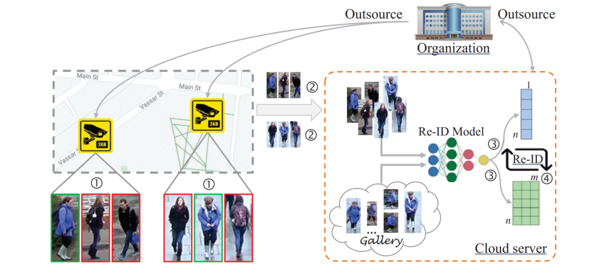
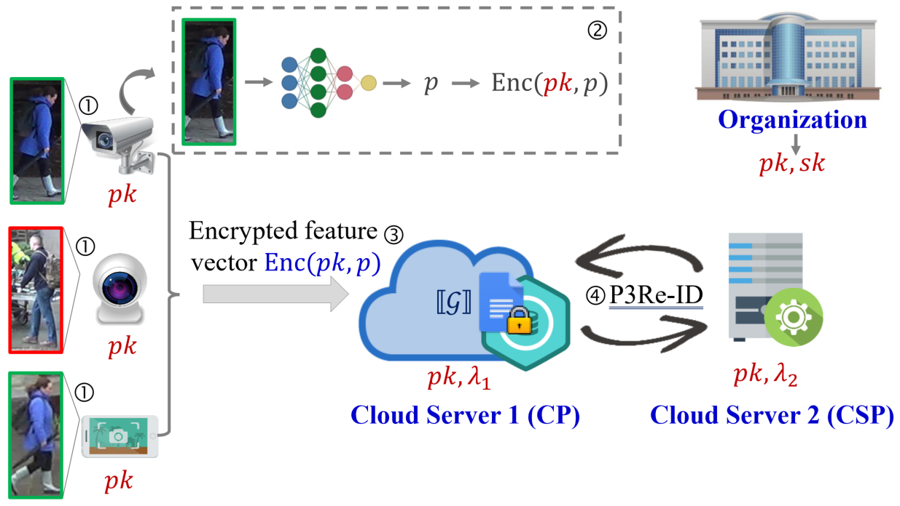
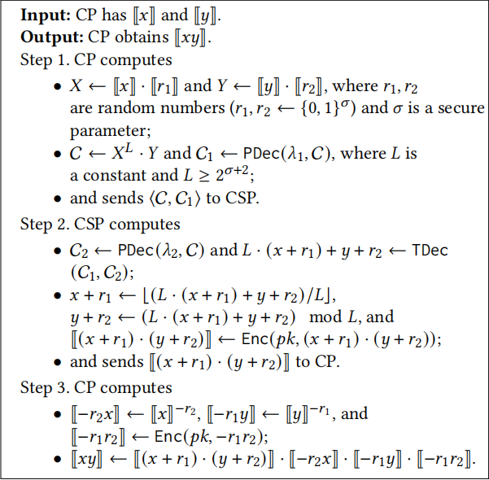

# <center>  FREED: Privacy-preserving Person Re-Identification </center>


# Person Re-identification

Person re-identification (Re-ID) is a crucial technology within the domain of computer vision, focused on the identification of a specific individual from images obtained through surveillance cameras. This technology has garnered significant attention due to its applicability in various scenarios.

As illustrated in Figure 1, organizations, such as police stations, often delegate person Re-ID tasks to a network of surveillance cameras and a centralized cloud server. This approach is adopted to optimize deployment costs. To execute the person Re-ID task, surveillance cameras placed in different locations capture images of individuals and transmit these images to the cloud server.

The cloud server receives a gallery provided by the organization, which comprises a collection of images featuring a target individual. It then proceeds to compare each submitted person image from the surveillance cameras with the individuals depicted in the gallery. If a match is identified, the cloud server relays the person Re-ID outcome to the organization. This result may encompass details like the camera's location where the match occurred, the image of the identified person, and the timestamp of the image capture.

Indeed, person Re-ID finds diverse applications in person tracking, including locating lost children and tracing individuals involved in criminal activities.



**Figure 1: Example of Conventional Person Re-Identification System**


# FREED

In recent years, person Re-identification (Re-ID) has given rise to significant concerns regarding the privacy of individual's images. The General Data Protection Regulation (GDPR) explicitly categorizes person images as personal and private data. Additionally, the video-surveillance guidelines established by the European Data Protection Supervisor (EDPS) assert that any form of surveillance represents an intrusion into the fundamental rights of personal data protection and the right to privacy.

Regrettably, there has been a notable absence of effective solutions to address image privacy concerns within the context of person Re-ID. Driven by these privacy imperatives, we introduce FREED, a groundbreaking system solution designed to preserve the privacy of person Re-ID. FREED is the first of its kind, enabling state-of-the-art person Re-ID operations while working with encrypted feature vectors derived from person images.

To effectively handle the encryption of feature vectors and facilitate efficient person Re-ID operations on encrypted feature vectors, FREED has developed a suite of batch secure computing protocols. These protocols are founded on a twin-server architecture and leverage the threshold Paillier cryptosystem. Our demonstrations have underscored the superior efficiency of our secure computing protocols compared to existing alternatives, with FREED achieving precision levels equivalent to the state-of-the-art plaintext methods.


# Preliminary

## 1. Threshold Paillier Cryptosystem

The protocols within the SOCI framework are constructed upon the foundation of the Paillier cryptosystem with threshold decryption (PaillierTD). This variant of the conventional Paillier cryptosystem divides the private key into two partially private keys. Importantly, neither of these partially private keys alone possesses the capability to effectively decrypt a ciphertext that has been encrypted using the Paillier cryptosystem. The PaillierTD scheme comprises the following algorithms.

$\textbf{Key Generation} (\textsf{KeyGen})$: Let $p,q$ be two strong prime numbers (i.e., $p=2p'+1$ and $q=2q'+1$, where $p'$ and $q'$ are prime numbers) with $\kappa$ bits (e.g., $\kappa=512$). Compute $N=p\cdot q$, $\lambda=lcm(p-1,q-1)$ and $\mu=\lambda^{-1}\mod N$. Let the generator $g=N+1$, the public key $pk=(g,n)$ and the private key $sk=\lambda$.

The private key $\lambda$ is split into two parts denoted by $sk_1=\lambda_1$ and $sk_2=\lambda_2$, s.t., $\lambda_1+\lambda_2=0\mod\lambda$ and $\lambda_1+\lambda_2=1\mod N$. According to the Chinese remainder theorem, we can calculate $\sigma=\lambda_1+\lambda_2=\lambda\cdot\mu\mod(\lambda\cdot\mu)$ to make $\delta=0\mod\lambda$ and $\delta=1\mod N$ hold at the same time, where $\lambda_1$ can be a $\sigma$-bit random number and $\lambda_2=\lambda\cdot\mu+\eta\cdot\lambda N-\lambda_1$ ($\eta$ is a non-negative integer).

$\textbf{Encryption} (\textsf{Enc})$: Taken as input a message $m\in\mathbb{Z}_N$, this algorithm outputs $[m]\leftarrow\textsf{Enc}(pk,m)=g^m\cdot r^N\mod N^2$, where $r$ is a random number in $\mathbb{Z}^*_N$ and $[m]=[m\mod N]$. 

$\textbf{Decryption} (\textsf{Dec})$: Taken as input a ciphertext $[m]$ and $sk$, this algorithm outputs $m\leftarrow\textsf{Dec}(sk,[m])=L([m]^{\lambda}\mod N^2)\cdot\mu\mod N$, where $L(x)=\frac{x-1}{N}$.

$\textbf{Partial Decryption} (\textsf{PDec})$: Take as input a ciphertext $[m]$ and a partially private key $sk_i$ ($i\in\{1,2\}$), and outputs $M_i\leftarrow\textsf{PDec}(sk_i,[m])=[m]^{\lambda_i}\mod N^2$.

For brevity, we will omot $\mod N^2$ for $\textsf{Enc}$ algorithm in the rest of the document.

PaillierTD has the additive homomorphism and scalar-multipilication homomorphism as follows.

- Additive homomorphism: $\textsf{Dec}(sk,[m_1+m_2\mod N])=\textsf{Dec}(sk,[m_1]\cdot[m_2])$;

- Scalar-multiplication homomorphism: $\textsf{Dec}(sk,[c\cdot m\mod N])=\textsf{Dec}(sk,[m]^c)$ for $c\in\mathbb{Z}^*_N$. Particularly, when $c=N-1$, $\textsf{Dec}(sk,[m]^c)=-m$ holds.

## 2. K-reciprocal Nearest Neighbors

Accurate object retrieval methods generally adopts $k$-reciprocal nearest neighbors ($k$-RNN), especially for person Re-ID methods. Let $k$-NN (the $k$-nearest neighbors) $\mathcal{N}(p, k)$ denotes $k$ vectors in a database $\mathcal{G}=\{g_1,\cdots,g_m\}$ most similar to a vector $p$, we have the top- $k$ samples of the ranking list:

$$\mathcal{N}(p, k)\subset\mathcal{G}, s.t. | \mathcal{N}(p, k) |=k,\textsf{sim}(p,\hat{g})>\textsf{sim}(p,g),\forall \hat{g}\in\mathcal{N}(p,k)  \text{and} \bar{g}\in\mathcal{G}\setminus\mathcal{N}(p,k).$$

where $\texttt{sim}(p,g)$ represents a similarity metric, (such as Mahalanobis distance), $|\cdot|$ denotes the number of candidates in the set. The nearest neighbor relationship is asymmetric even though the similarity metric is symmetric, i.e., $\texttt{sim}(p, g)=\texttt{sim}(g,p)$. Thus, $p \in \mathcal{N}(g,k)$ does not genrally imply $g \in \mathcal{N}(p, k)$ \cite{qin2011hello}. Fig. \ref{fig:example} gives an example to demonstrate $k$-RNN. Formally, $k$-RNN is denoted by
$$\mathcal{R}(p,k)=\{g_i | g_i\in\mathcal{N}(p,k)\land p\in \mathcal{N}(g_i,k)\}.$$
Roughly speaking, $\forall~g_i\in\mathcal{R}(p, k)$, if $g_i$ is the $k$-nearest neighbors of $p$, then $p$ is also the $k$-nearest neighbors of $g_i$.


# System Architecture
 

**Figure 2: FREED System Architecture**

In our system, we consider an organization (e.g., Immigration& Checkpoints Authority, Police Station) outsources a privacy preserving person Re-ID task to twin cloud servers (i.e., a Cloud Platform (CP) and a Computation Service Provider (CSP)) and multiple participants with surveillance cameras. Participants use surveillance cameras and a person Re-ID model to capture persons images and extract feature vectors of person images, respectively. In contrast to the conventional person Re-ID system (see Figure 1), our proposed system enables participants to extract feature vectors in local and only submit encrypted feature vectors to CP. Imagesstored in local can effective protect image privacy.Furthermore,person Re-ID operations only require the feature vector ofthe person image rather than the image itself. As shown in Figure 2,FREED comprises an organization, twin cloud servers, and multipleparticipants with surveillance cameras.

- **Organization**:The organization holds a gallery $\mathcal{G}$ consisting of m feature vectors of a target person’s images and initializes a privacy-preserving person Re-ID task. Specifically, the organization calls KeyGen to generate $(pk, sk)$ a $public/private$ key pair and splits $sk$ into $(\lambda_1, \lambda_2)$ two partially private keys. Next, she distributes $(pk, \lambda_1)$ and $(pk, \lambda_2)$ to CP and CSP, respectively. Finally, she encrypts the feature vectors in $\mathcal{G}$ with $pk$ and stores $[\mathcal{G}]=\{[g_1],\cdots,[g_m]\}$ the encrypted feature vector gallery on CP.
- **Participant**:The participant uses the surveillance camera to capture person images and extracts the feature vector $p$ of the captured person's image. In order to protect the person's image privacy, the participant encrypts $p$ with $pk$ sent from CP and only submits encrypted feature vector $[p]$ to CP.
- **CP**:CP takes charge of storing $[\mathcal{G}]$ sent from the organization and receiving an encrypted feature vector $[p]$ sent from participants. Note that CP can directly execute certain homomorphic operations over encrypted data supported by the threshold Paillier cryptosystem. CP cooperates with CSP to perform extra homomorphic operations over encrypted data, such as homomorphic multiplication and comparison.
- **CSP**: CSP is responsible for providing online computation services and notifying the organization of the person ReID result. Specifically, CSP and CP jointly execute privacypreserving person Re-ID operations to check whether the encrypted feature vector $[p]$ generated by participants matches the encrypted feature vectors in $[\mathcal{G}]$ of the target person or not. If yes, the captured person by the participant is the target person, but not vice versa.

# Privacy-preserving Person Re-Identification

## 1. Problem Formulation

To self-contained, before defining privacy-preserving person Re-ID (P3Re-ID), we first review person Re-ID. Roughly speaking, P3Re-ID is simply an encrypted version of person Re-ID, i.e., P3ReID is to check whether or not the encrypted feature vector of a captured person's image matches the encrypted feature vectors in a gallery of a target person's images. By contrast, person Re-ID is simply a non-private version of P3Re-ID.
&emsp;&emsp;Person Re-ID takes the feature vector $p$ of a captured person's image and the feature vector gallery $\mathcal{G}$ of a target person's images as inputs and calculates $\mathcal{R}(p,k)$ (see Eq. (4)). If $|\mathcal{R}(p,k)|$ is larger than a threshold (e.g., $|\mathcal{R}(p,k)|\ge k$), $p$ can be considered a feature representation of the target person's images, i.e., the captured person is the target person. According to $k$-RNN, person Re-ID can be defined as follows. 
&emsp;&emsp;**Definition 1** (PERSON Re-ID). Formally, a person re-identification method Î $\Phi$ can be formulated as

  $$\Phi(p,\mathcal{G})=\begin{cases}1, & { |\mathcal{R}(\boldsymbol{p},k)|\geq \varepsilon} \\
0, & { otherwise} 
\end{cases}$$

 where $p$ denotes the feature vector of a captured person’s image, $\mathcal{G}$ is the feature vector gallery of a target person’s images.
&emsp;&emsp;In contrast to person Re-ID, P3RE-ID takes the encrypted feature vector $[\mathcal{p}]$ of the captured person’s image and the encrypted feature vector gallery $[\mathcal{G}]$ of the target person’s images as inputs and calculates $\mathcal{R}^\diamond([\boldsymbol{p}], k)$ In this paper, we define $\mathcal{R}^\diamond([\boldsymbol{p}], k)$ as
$$\mathcal{R}^\diamond([\boldsymbol{p} ], k)=\{[\boldsymbol{g}_i]\in\mathcal{N}([\boldsymbol{p} ],k)\land [\boldsymbol{p} ]\in \mathcal{N}([\boldsymbol{g}_i],\lfloor\omega k\rfloor)\},$$ where $k$ and $\omega$ are two control parameters and used to control the similarity metric between $[\mathcal{p}]$ and $[\mathcal{g_i}]$, and $\lfloor\cdot\rfloor$ denotes a round
off operation. Particularly, $k$ is a random integer in the interval (0, |G|) and $\omega$ is a random number in the interval $(0, \frac{|\boldsymbol{\boldsymbol{\mathcal{G}}}|}{k})$. Formally, $\mathcal{N}([\boldsymbol{p} ], k)$ is denoted by 

$$\begin{aligned}
    &\mathcal{N}([\boldsymbol{p} ], k)\subset[\boldsymbol{\mathcal{G}}],\nonumber\\
    \mathop{\mathrm{s.t. }} &|\mathcal{N}([\boldsymbol{p} ], k)|=k,\nonumber\\
    &\texttt{sim}([\boldsymbol{p} ],[\hat{\boldsymbol{g}}])>\texttt{sim}([\boldsymbol{p} ],[\bar{\boldsymbol{g}}]), \forall [\hat{\boldsymbol{g}}]\in\mathcal{N}([\boldsymbol{p} ],k){ and }\nonumber\\
    &[\bar{g}]\in[\boldsymbol{\mathcal{G}}]\setminus\mathcal{N}([\boldsymbol{p} ],k)
\end{aligned}$$ 

where $\texttt{sim}([\boldsymbol{p} ],[\boldsymbol{g} ])$ indicates the similarity metric between $[p]$ and $[g]$.
&emsp;&emsp;Person Re-ID usually uses Mahalanobis distance $d(\boldsymbol{p}, \boldsymbol{g})$ to quantify the similarity metrics among feature vectors, e.g., $\texttt{sim}(\boldsymbol{p}, \boldsymbol{g})=-d(\boldsymbol{p}, \boldsymbol{g})$.when the norm of $p$, $g$ is 1,Mahalanobis distance $d(\boldsymbol{p}, \boldsymbol{g})$ between $p$ and $g$ can be converted into the cosine similarity $cos(\boldsymbol{p}, \boldsymbol{g})$ between $p$ and $g$ , i.e., 

$$\begin{aligned}
    d(\boldsymbol{p}, \boldsymbol{g})=\sqrt{2-2cos(\boldsymbol{p}, \boldsymbol{g})}=\sqrt{2-2\boldsymbol{p}\cdot \boldsymbol{g}}.
\end{aligned}$$ 

Thus, we define $\texttt{sim}(\boldsymbol{p}, \boldsymbol{g})$ as $$\texttt{sim}([\boldsymbol{p} ],[\boldsymbol{g} ])=\texttt{Dec}(sk, [\boldsymbol{p} \cdot \boldsymbol{g}]).$$ &emsp;&emsp;Similar to person Re-ID, if $\mathcal{R}^\diamond([\boldsymbol{p}], k)$ is larger than a threshold,$p$ can be considered a feature representation of the target person’s images, i.e., the captured person is regarded as the target person. Thus, P3Re-ID can be defined as follows.
&emsp;&emsp;**Definition 2** (P3Re-ID).Formally, a privacy-preserving person Re-ID method $\Psi$ can be formulated as 

$$\Psi([\boldsymbol{p}], [\boldsymbol{\mathcal{G}}])=\begin{cases}1, & { if |\mathcal{R}^\diamond([\boldsymbol{p} ], k)|\geq\epsilon k} \\
0, &{ otherwise}
\end{cases}$$

where $[p]$ denotes the encrypted feature vector of a captured person’s image, $\mathcal{G}$ is the encrypted feature vector gallery of a target person’s images, and $\epsilon$($\epsilon\in(0, 1]$) is a control parameter.
&emsp;&emsp;Note that the larger of $k$ and $\omega$, the less limitation for $p$, i.e., $p$ is more easy to be regarded as the feature representation of the target person’s images, and is easy to introduce a false positive. Conversely, the less of $k$ and $\omega$, it is likely to introduce a false negative. Also, it is easy to see that the larger $\epsilon$, the less possibility of $p$ being regarded as the feature representation of the target person’s images.
&emsp;&emsp;This paper exploits the state-of-the-art multiple granularities network and 𝑘RNN to extract feature vectors of person images and rank the similarity metrics among feature vectors, respectively. According to the definition of multiple granularities network, each item in the feature vector is a positive float-point number and the norm of $p$, $g_i$ is 1. Let $\boldsymbol{p}=(p^1,\cdots,p^j\cdots,p^n )$ and $\boldsymbol{g}=( g^1,\cdots,g^j,\cdots,g^n)$,where $n$ is the dimension of the feature vector, we see that $p^j,g_i^j$ are positive floating-point numbers. Thus, P3RE-ID requires to handle the encryption of float-point numbers effectively.

## 2. Encoding Mechanism (ECMO)

To enable the threshold Paillier cryptosystem that can only encrypt integers to encrypt float-point numbers, the float-point feature vectors of person images must be converted into integer feature vectors. Although there exists a number of encoding mechanisms that convert float-point numbers into integers, they suffer from some drawbacks, such as a decoding error, high calculation error rate and encryption costs, and complex computations.
&emsp;&emsp;Given a float-point number $x$, a common encoding mechanism encodes it as $x\cdot 10^{t}$. However, in computer, $\frac{x\cdot 10^{t}}{10^{t}}$ may not be exactly the same as the original $x$ in many cases. In other words, the common method frequently results in a decoding error. Furthermore, the decoding error leads to that $\frac{\texttt{Dec}(sk, [ x\cdot 10^{t}])}{10^t}$ may not
be the original $x$, which means that 𝑥 might be changed after one encryption and one decryption operations. In order to handle the encoding of neural network model parameters effectively, the encoding mechanism in assumes the float-point number $x$ is in the interval $[min, max]$ and is converted into a $\ell$-bit integer, i.e.,
$x\rightarrow[(2^\ell-1)\cdot(x-min)/(max-min)]-2^{\ell-1}+1$ when $x<0$, whereas,
$x\rightarrow[(2^\ell-1)\cdot(x-min)/(max-min)]-2^{\ell-1}$, where $[\cdot]$ is the standard rounding function. However, when $|[min, max]|>2^\ell$, different float-point numbers are converted into the same integer. Thus, the encoding mechanism also suffers from the decoding error, and since it uses the standard rounding function to convert floating point numbers into integers, it faces a high calculation error rate.
&emsp;&emsp;To prevent the decoding error, Liu *et al*. converted the float-point number into multiple integer tuples $[3,4]$. In [3], the float-point number $x$ is denoted by $\langle x \rangle=(s, m, t)$, where $s$ is the sign bit of $x$ and $s\in\{0,1\}$, $m$ is an integer with $\eta$-digital number, and $t$ is also an integer and indicates the exponent of $x$. On the other hand, as any float-point number can be denoted by fraction, i.e., $$x=\frac{x^\uparrow}{x^\downarrow},$$ where both $x^\uparrow$ and $x^\downarrow$ are integers. In [4], the float-point number $x$ is denoted by $\langle x \rangle=(x^\uparrow, x^\downarrow)$. To encrypt the float-point number 𝑥, [3] and [4] need to encrypt three and two integers, respectively. Both [3] and [4] makes the homomorphic operations over encrypted float-point numbers more complex than that on encrypted integers.
&emsp;&emsp;To overcome the above drawbacks, we develop a new encoding mechanism (named, ECMO) that prevents the decoding error and significantly reduces the calculation error rate as well as the costs in encryption and computation. Formally, given a float-point number $x$, ECMO encodes it as $$q_x=\mathcal{Q}(x)=\frac{x^\uparrow}{x^\downarrow}\cdot2^\ell,$$ where $\ell$ is a constant (e.g., $\ell$ = 53 is used to encode a 64-bit floatpoint number). Clearly, as long as $\ell$ is larger than the length of mantissa of $x$ in bit, $q_x$ must be an integer. And that we have $q_x^\downarrow=1$ and $q_x^\uparrow=\frac{x^\uparrow}{x^\downarrow}\cdot2^\ell$, where $q_x^\uparrow$ and $q_x^\downarrow$ are numerator and denominator of $q_x$ , respectively. Besides, given the encoding result of $x$ denoted by $q_x$ , ECMO decodes it as $$\mathcal{Q}(x)^{-1}=q_x/2^\ell.$$ &emsp;&emsp;According to Eqs (11) and (12), we see that
$$\mathcal{Q}(x)^{-1}=\frac{q_x^\uparrow}{q^\downarrow_x\cdot 2^\ell}=\frac{x^\uparrow \cdot 2^\ell}{x^\downarrow \cdot 2^\ell}=\frac{x^\uparrow}{x^\downarrow}=x.$$ Therefore, $\mathcal{Q}(x)^{-1}=x$ always holds, i.e., given the float-point number $x$, ECMO always decodes correctly.
&emsp;&emsp;For the encryption of the float-point number $x$, through ECMO, it requires to call Enc only once to encrypt $x$, i.e., $[ x]\leftarrow\texttt{Enc}(pk, \mathcal{Q}(x))$.
ECMO does not use the rounding function, which reduces the error. Also, ECOM enables the homomorphic operations on encrypted floatpoint numbers to be the same as that on encrypted integers; it also enables computations over encrypted float-point numbers to be easy. Note that when $x$ is a float-point number, we use $[x]$ to denote $[\mathcal{Q}(x)]$ in the rest paper to simplify notation.


## 3.  Batch Secure Computing Protocol

According to Definition 2, P3Re-ID requires to perform multiplication and comparison operations on encrypted feature vectors. To reduce the costs in communication and computation of computing the similarity metrics among encrypted feature vectors and
ranking the similarity metrics, we develop a batch secure multiplication protocol (BatchSMUL) and a batch partial decryption protocol
(BatchPDec), respectively.
&emsp;&emsp;Previous solutions [3, 5, 6] has constructed a secure computation protocol (SM) based on a non-colluding twin-server architecture and the Paillier cryptosystem, but they suffer from some disadvantages. One server in [5, 6] holds the private key, so the server can decrypt any ciphertext by itself, such as $[p]$ and $[g_i]$
($g_i \in \mathcal{G}$), which may leak a person’s feature vectors. To tackle the problem, [3] exploits the threshold Paillier cryptosystem and splits the private key into two partially private keys, where each server only holds one partially private key. However, for one multiplication
operation, [3] requires the twin-server to execute four decryption operations and transmit five ciphertexts.
&emsp;&emsp;To overcomes disadvantages in existing solutions [3, 5, 6], we propose a new secure multiplication protocol (SMUL). Specifically, given two ciphertexts $[x]$ and $[y]$ , where $x,y\in[0, 2^\ell)$ , SMUL($[x]$, $[y]$) outputs $[xy]$ , i.e., $\texttt{SMUL}([ x],[ y]) \rightarrow[ xy]$ . As shown in Algorithm 1, SMUL consists of three steps.
&emsp;&emsp;(1) CP selects two random numbers $r_1, r_2 \leftarrow \{0,1\}^\sigma$ , where $\sigma$ is a secure parameter and $2^\sigma \gg 2^\ell$ , and blinds $x$ and $y$ via the additive homomorphism as $X\leftarrow[ x]\cdot[ r_1]$ and $Y\leftarrow[ y]\cdot[ r_2]$ . Then CP calculates $\mathcal{C}\leftarrow X^L\cdot Y$ and calls PDec to partially decrypt $C$ to get $C_1$, where $L$ is a constant and $L\geq2^{\sigma+2}$ . Finally, CP sends $(\mathcal{C}, \mathcal{C}_1)$ to CSP.
&emsp;&emsp;(2) CSP calls PDec to partially decrypt $C$ to get $c_2$ and then calls TDec to obtain $L\cdot(x+r_1)+y+r_2$ with $C_1$ and $C_2$. After that, CSP computes $x+r_1=\lfloor(L\cdot(x+r_1)+y+r_2)/L\rfloor$ and $y+r_2=(L\cdot(x+r_1)+y+r_2)\mod L$ . Finally, CSP encrypts $(x+r_1)\cdot(y+r_2)$ with the public key $pk$, and returns the ciphertext $[(x+r_1)\cdot(y+r_2)]$ to CP.
&emsp;&emsp;(3) As CP knows $r_1,r_2$, $[ x]$, and $[ y]$, it can obtain $[-r_2 x]$, $[-r_1 y]$, and $[-r_1 r_2]$ via scalar-multiplication homomorphism. Taking $[-r_2 x]$, $[-r_1 y]$,
$[-r_1 r_2]$, and $[(x+r_1)\cdot(y+r_2)]$ as inputs, through additive homomorphism, CP computes $[(x+r_1)\cdot(y+r_2)]\cdot[-r_2 x]\cdot[-r_1 y]\cdot[-r_1 r_2]$ to obtain $[ xy]$.



**Algorithm 1: $\texttt{SMUL}([ x],[ y]) \rightarrow[ xy]$**

&emsp;&emsp;We next extend SMUL to a batch secure multiplication protocol, called BatchSMUL, for handling batch secure multiplications.And since 
$0\leq \mathcal{Q}(\boldsymbol{p} \cdot \boldsymbol{g}_i)\ll N$,we can use the same idea that CP and CSP jointly decrypt encrypted values to extend PDec to a batch partial decryption protocol,called BatchPDec, for handling batch partial decryption. Specifically, at the step 1, CP firstly computes 

$$\mathcal{D}\leftarrow\Pi_{i=1}^{i=\delta}[\boldsymbol{p} \cdot \boldsymbol{g}_i]^{L'^{i-1}},$$ 

where $\delta=\lfloor\frac{|N|}{|L'|}\rfloor$ and $L'\geq2^{2\ell+2}$ . Next, CP calculates $\mathcal{D}_1\leftarrow\texttt{PDec}(\lambda_1, \mathcal{D})$ by calling PDec and sends $(\mathcal{D},\mathcal{D}_2)$ to CSP. At the step 2, CSP calculates $\mathcal{D}_2\leftarrow\texttt{PDec}(\lambda_2, \mathcal{D})$ and
$d\leftarrow\texttt{TDec}(\mathcal{D}_1,\mathcal{D}_2)$
by calling PDec and TDec to get

$$\begin{cases}
    \left\{
    \begin{aligned}
        &d=\sum_{i=1}^{i=\delta}L^{i-1}\cdot\mathcal{Q}(\boldsymbol{p} \cdot \boldsymbol{g}_i),\\
        &\mathcal{Q}(\boldsymbol{p} \cdot \boldsymbol{g}_i)=\lfloor dmod L^i/L^{i-1}\rfloor.
    \end{aligned}
    \right.
\end{cases}$$

Thus, based on BatchPDec, CSP can obtain 

$$\{\mathcal{Q}(\boldsymbol{p} \cdot \boldsymbol{g}_1), \cdots, \mathcal{Q}(\boldsymbol{p} \cdot \boldsymbol{g}_{|\boldsymbol{\mathcal{G}}|})\}$$

, so it can rank them with any efficient sorting algorithms, such as quicksort.

## 4.  FREED Design

In this section, we elaborate on how to combine ECMO, BatchSMUL,and BatchPDec to implement P3RE-ID. Specifically, ECMO is used to convert the float-point feature vectors of person images into integer feature vectors. BatchSMUL and BatchPDec are used to compute and rank the similarity metrics among encrypted feature vectors,respectively.
&emsp;&emsp;Algorithm 3 lists the construction $\Psi([\boldsymbol{p} ], [\boldsymbol{\mathcal{G}}])$ in detail. Given an encrypted feature vector $[p]$ and an encrypted feature vector gallery 

$$[\boldsymbol{\mathcal{G}}]=\{[\boldsymbol{g}_1],\cdots,[\boldsymbol{g}_{|\boldsymbol{\mathcal{G}}|}]\},$$

$\Psi([\boldsymbol{p} ], [\boldsymbol{\mathcal{G}}])$ outputs 1 if
$|\mathcal{R}^\diamond([\boldsymbol{p} ], k)|\geq\epsilon k$,
otherwise, outputs 0, i.e., $\Psi([\boldsymbol{p} ], [\boldsymbol{\mathcal{G}}])\rightarrow\{0,1\}$.As shown in Algorithm 3, $\Psi([\boldsymbol{p} ], [\boldsymbol{\mathcal{G}}])$ comprises three steps.
&emsp;&emsp;(1) CP and CSP jointly compute 

$$\{[\boldsymbol{p} \cdot \boldsymbol{g}_1],\cdots,[\boldsymbol{p} \cdot \boldsymbol{g}_{|\boldsymbol{\mathcal{G}}|}]\}$$

by calling BatchSMUL, i.e., they calculate

$$[\boldsymbol{p} \cdot \boldsymbol{g}_i]\leftarrow\Pi_{j=1}^{j=n}\texttt{SMUL}([\boldsymbol{p}^j], [\boldsymbol{g}_i^j]){ for }i\in[1, |\boldsymbol{\mathcal{G}}|],$$

where $\boldsymbol{p}=( p^1,\cdots,p^n ) \text{ , } \boldsymbol{g}_i=( g_i^1,\cdots,g_i^n )$ , and $n$ is the dimension of the feature vector (in this paper, $n$ = 2048).
&emsp;&emsp;(2) After obtaining 

$$\{[\boldsymbol{p} \cdot \boldsymbol{g}_1],\cdots,[\boldsymbol{p} \cdot \boldsymbol{g}_{|\boldsymbol{\mathcal{G}}|}]\}$$

, CSP cooperates with CP to compute

$$\{\mathcal{Q}(\boldsymbol{p} \cdot \boldsymbol{g}_1),\cdots,\mathcal{Q}(\boldsymbol{p} \cdot \boldsymbol{g}_{|\boldsymbol{\mathcal{G}}|})\}$$

by calling BatchPDec. Then, CSP sorts

$$\{\mathcal{Q}(\boldsymbol{p} \cdot \boldsymbol{g}_1),\cdots,\mathcal{Q}(\boldsymbol{p} \cdot \boldsymbol{g}_{|\boldsymbol{\mathcal{G}}|})\}$$ 

in descending order to obtain the indexes (denoted by $I$ ) of the top- $k$ values. Without loss of generality, assume $\mathcal{Q}(\boldsymbol{p} \cdot \boldsymbol{g}_1)\geq\cdots\geq\mathcal{Q}(\boldsymbol{p} \cdot \boldsymbol{g}_k)$
and set $I=\{1,\cdots, k\}$. Thus, $\mathcal{N}([\boldsymbol{p} ], k)=\{[\boldsymbol{g}_1],\cdots,[\boldsymbol{g}_k]\}$.
&emsp;&emsp;(3) CSP compares $\mathcal{Q}(\boldsymbol{p} \cdot \boldsymbol{g}_i)$ and $\mathcal{Q}(\boldsymbol{g}_i \cdot \boldsymbol{g}_i^{(k)})$, where $i\in I$ and $\boldsymbol{g}_i^{(k)}$ is the last item of $\mathcal{N}(\boldsymbol{g}_i, k)$. If $\mathcal{Q}(\boldsymbol{p} \cdot \boldsymbol{g}_i)\geq\mathcal{Q}(\boldsymbol{g}_i\cdot \boldsymbol{g}_i^{(k)})$, $\boldsymbol{p} \in \mathcal{N}(\boldsymbol{g}_i,k)$, whereas, $\boldsymbol{p} \notin \mathcal{N}(\boldsymbol{g}_i,k)$.  CSP counts the number of $\boldsymbol{p} \in \mathcal{N}(\boldsymbol{g}_i,k)$, i.e., CSP computes $|\mathcal{R}^\diamond([\boldsymbol{p} ], k)|$. When $count \geq \epsilon k$, CSP obtains 1, otherwise, 0.


# FREED API Description

The project in this version is written in python.

## generate_paillier_keypair()

Taken as input a security parameter $\kappa$, this algorithm generates two strong prime numbers $p$, $q$ with $\kappa$ bits. Then, it compute $N = p\cdot q$, $\lambda=lcm(p-1,q-1)$, $\mu=\lambda^{-1}\mod N$ and $g= N+1$. It outputs the public key $pk=(g,N)$ and private key $sk=\lambda$. 

Taken as input the private key  $sk$ , it computes $sk_1$ and $sk_2$. The private key $sk=\lambda$ is split into two parts denoted by $sk_1 = \lambda_1$ and $sk_2 = \lambda_2$, s.t., $\lambda_1+\lambda_2=0\mod\lambda$ and $\lambda_1+\lambda_2=1\mod N$. 

- PaillierPublicKey(). This class outputs the public key public_key= $(g,N)$.


- PaillierPrivateKey(). This class outputs the private key private_key= $\lambda$.


- PartialPaillierPrivateKey(). This class outputs the partial private keys partial_private_keys= $(sk_1,sk_2)$.


## encrypt()
Taken as input a plaintext $m$,  this algorithm encrypts $m$ into ciphertext $c$ with public $pk$. In the computations of SOCI, the value of message m should be between $-N/2$ and $N/2$.


## decrypt()
Taken as input a ciphertext $c$,  this algorithm decrypts $c$ into plaintext $m$ with secret key $sk$. The input ciphertext $c$ should be between 0 and $N^2$ to guarantee correct decryption.


## partial_decrypt()
Given a ciphertext $c$, this algorithm partial decrypts $c$ into partially decrypted ciphertext $C_1$ with partial secret key $sk_1$, or partial decrypts $c$ into $C_2$ with $sk_2$.

- cp.partial_decrypt(): This algorithm is executed by cloud platform for partial decryption.

- csp.partial_decrypt(): This algorithm is executed by computation service provider for partial decryption.


## smul()
Given ciphertexts $ex$ and $ey$, this algorithm computes the multiplication homomorphism and outputs the result $ciphertext$. Suppose $ex=[ x]$ and $ey=[ y]$. Then, the result $ciphertext=[ x\cdot y]$. 


## _add_encrypted()
Given two ciphertext $c_1$ and $c_2$,  this algorithm computes the additive homomorphism and output the result $res$. Suppose $c_1=[ m_1]$ and $c_2=[ m_2]$. Then, the result $sum_{ciphertext}=[ m_1+m_2]$. The input ciphertexts $c_1$ and $c_2$ should between 0 and $N^2$. 

## scmp()
Given ciphertexts $ex$ and $ey$, this algorithm computes the secure comparison result $res$. Suppose $ex=[ x]$ and $ey=[ y]$. Then, the result $ciphertext=[ 1]$ if x<y , and $ciphertext=[ 0]$ if $x\geq y$. 

## sdot_vector()

Given ciphertexts $ex$ and $ey$, this algorithm computes the dot production of vectors and outputs the result $ciphertext$. Suppose $ex=[ x]$ and $ey=[ y]$, where vectors $x=(x_1,\cdots,x_n)$, $y=(y_1,\cdots,y_n)$ and $[ x]=([ x_1],\cdots,[ x_n])$, $[ y]=([ y_1],\cdots,[ y_n])$. Then, the result $enc_{dot}=[ z]$, where $$z=\sum_{i=1}^n x_i\cdot y_i.$$ 


## extractFeatures()
Taken as input a gallery $probe$, this algorithm extracts feature vectors of the gallery and outputs the result $features$.

## krnn()
Given two extracted feature vectors $qf$ and $gf$,where $qf$ is the vector of input picture and $gf$ is the vector of the gallery for target person. This algorithm computes the similarity metrics q_g_dist, ranks the 𝑘-reciprocal nearest neighbors and compares the similarity metrics with the 𝑘-reciprocal nearest neighbors. Then the algorithm outputs $probe$, where probe is the matched picture.


# Build Dependencies

* OS: Windows 11
* numpy


# Build FREED
```sh
pip install -r requirements.txt 
```

## Run FREED
```sh
python3 algorithm_test.py
```
## Output:
    set x =   1238572
    E(x) =  3826160357666431518607150556354038784177936683067937390247450490466221182937130105714823719210263345731984551021854473948477649851606869129410293163209184
    compute encrypt function, its running time is ------  0.366200 ms
    x=  1238572
    ---------------------------
    set x =   726173
    compute decrypt function, its running time is ------  0.000300 ms
    x=  726173
    ---------------------------
    set x = 18413, y = 2847
    run _add_encrypted function, its running time is  ------  0.006900 ms
    x + y = 21260
    ---------------------------
    set x = 123, y = 222
    compute scl_mul function, its running time is  ------  0.017100 ms
    x*y = 27306
    ---------------------------
    Secure computation protocols
    set x = 99, y = 789
    compute SMUL function, its running time is  ------  4.175300 ms
    x*y = 78111
    ---------------------------
    set x = 99, y = 789
    compute SCMP function, its running time is  ------  3.285400 ms
    x<y 
    ---------------------------
    set qf=[[0.  1.2 2.4]] 
    set gf=[[0.  1.3 2.6]
            [1.  2.3 3.6]
            [2.  3.3 4.6]
            [3.  4.3 5.6]
            [4.  5.3 6.6]]
    compute sdot function, its running time is ------ 63.487300ms
    q_g_dist=[[ 7.8 11.4 15.  18.6 22.2]]
    ---------------------------


# Benchmark
in funtion generate_paillier_keypair(n_length,sigma_length), you can change the value of KEY_LEN_BIT and SIGMA_LEN_BIT . KEY_LEN_BIT determine the big prime's length in bit, and  SIGMA_LEN_BIT determine the length of $sk_1$ in bit. 

# Performance

We used different KEY_LEN_BIT to test the performance of each function. The experimental environment is a laptop with CPU 10th Gen Intel(R) Core(TM) i5-10210U, 2 cores @ 2.70GHz and 2 cores @ 2.69 GHz, and 16G memory. The experimental results are as follows.

**Table 1: Decoding Error Rate**
|   | 1K | 10K | 100K | 1,000K | 10,000K |  Average |
| ------ | ------ | ------ | ------ |------ |------ |  ------ |
| BatchCrypt [7] | 0.426 | 0.441 | 0.434 | 0.437 | 0.437 |  0.437 |
| POP [8] | 0.084 | 0.087 | 0.088 | 0.089 | 0.088 | 0.088  |
| **ECMO** | **0.000** | **0.000** | **0.000** | **0.000** | **0.000** | **0.000**  |


**Table 2: Calculation Error Rate**
|   | 1K | 10K | 100K | 1,000K | 10,000K |  Average |
| ------ | ------ | ------ | ------ | ------ | ------ |  ------ |
| BatchCrypt [7]  | 0.814 | 0.815 | 0.814  | 0.814 | 0.813  | 0.813  |
| POP [8] | 0.702 | 0.705 | 0.705  | 0.705 | 0.705  | 0.705  |
| **ECMO** | 0.231 | 0.218 |  0.223 | 0.222 | 0.222  |  0.222 |


**Table 3: Comparison of Communication Overhead**
| \|N\| | 512 | 1024 | 1536  | 2048 |
| ------| ------ | ------ | ------ | ------|
| SM [3] | 0.374 KB | 0.749 KB | 1.124 KB  | 1.499 KB |
| BatchSMUL | 0.187 KB | 0.312 KB | 0.437 KB  | 0.562 KB |
| SM:BatchSMUL | 2.000 | 2.401  |  2.572 | 2.667 |
| PDec [3]| 0.125 KB | 0.250 KB | 0.375 KB  | 0.500 KB |
| BatchPDec | 0.021 KB | 0.019 KB | 0.020 KB  | 0.019 KB |
| PDec:BatchPDec | 5.952 | 13.158 | 18.750  | 26.316 |

# Reference

1. Bowen Zhao, Jiaming Yuan, Ximeng Liu, Yongdong Wu, Hwee Hwa Pang, and Robert H. Deng. SOCI: A toolkit for secure outsourced computation on integers. IEEE Transactions on Information Forensics and Security, 2022, 17: 3637-3648.

2. Bowen Zhao, Yingjiu Li, Ximeng Liu, Hwee Hua Pang, and Robert H. Deng. FREED: An efficient privacy-preserving solution for person re-identification. IEEE Conference on Dependable and Secure Computing (DSC), 2022, pp. 1-8.

3. Ximeng Liu, Robert H Deng, Wenxiu Ding, Rongxing Lu, and Baodong Qin. 2016. Privacy-preserving outsourced calculation on floating point numbers. IEEE Transactions on Information Forensics and Security 11, 11 (2016), 2513–2527.

4. Ximeng Liu, Kim-Kwang Raymond Choo, Robert H Deng, Rongxing Lu, and Jian Weng. 2018. Efficient and privacy-preserving outsourced calculation of rational numbers. IEEE Transactions on Dependable and Secure Computing 15, 1 (2018), 27–39.

5. Yousef Elmehdwi, Bharath K Samanthula, and Wei Jiang. 2014. Secure k-nearest neighbor query over encrypted data in outsourced environments. In IEEE International Conference on Data Engineering. IEEE, 664–675.

6. Zekeriya Erkin, Thijs Veugen, Tomas Toft, and Reginald L Lagendijk. 2012. Generating private recommendations efficiently using homomorphic encryption and data packing. IEEE Transactions on Information Forensics and Security 7, 3 (2012), 1053–1066.

7. Chengliang Zhang, Suyi Li, Junzhe Xia, Wei Wang, Feng Yan, and Yang Liu. 2020. BatchCrypt: Efficient homomorphic encryption for cross-silo federated learning. In 𝑈 𝑆𝐸𝑁 𝐼𝑋 Annual Technical Conference. 493–506.

8. Lan Zhang, Taeho Jung, Cihang Liu, Xuan Ding, Xiang-Yang Li, and Yunhao Liu. 2015. POP: Privacy-preserving outsourced photo sharing and searching for mobile devices. In IEEE International Conference on Distributed Computing Systems. IEEE, 308–317.
